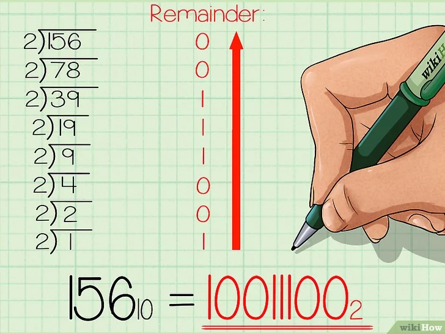

# 位运算

## 原码反码补码

- 补码(twos complement) 在计算机系统中，数值一律用补码来表示（存储）。 主要原因：使用补码，可以将符号位和其它位统一处理；同时，减法也可按加法来处理。另外，两个用补 码表示的数相加时，如果最高位（符号位）有进位，则进位被舍弃。
- 正数的原码补码反码相同
- 负数的反码是对其原码逐位取反（符号位除外）
- 负数的补码是对其原码逐位取反（符号位除外），然后整个数加1

## XOR - 异或

异或: 相同为 0，不同为 1。也可用“不进位加法”来理解。 异或操作的一些特点:

- x ^ 0 =x
- x ^ 1s = ~x // 注意 1s = ~0
- x ^ (~x) = 1s  (1s 这里指二进制全1)
- x ^ x = 0 // interesting and important!
- c = a ^ b => a ^ c = b, b ^ c = a // 交换两个数
- a ^ b ^ c = a ^ (b ^ c) = (a ^ b) ^ c // associative

## 指定位置的位运算

- 1. 将 x 最右边的 n 位清零: x & (~0 << n)  
- 2. 获取 x 的第 n 位值(0 或者 1): (x >> n) & 1
- 3. 获取 x 的第 n 位的幂值:  x & (1 << (n - 1))
- 4. 仅将第 n 位置为 1:x | (1 << n)
- 5. 仅将第 n 位置为 0:x & (~ (1 << n))
- 6. 将 x 最高位至第 n 位(含)清零:x & ((1 << n) - 1)
- 7. 将第 n 位至第 0 位(含)清零:x & (~ ((1 << (n + 1)) - 1))

## 实战位运算要点

### 判断奇偶:

- x % 2 == 1 —> (x & 1) == 1   
- x % 2 == 0 —> (x & 1) == 0  

### 除以 2 

- x = x / 2
- x = x >> 1
- mid = (left + right) / 2;   

### 其它

- x = x & (x-1) 清零最低位的 1   
- x & -x => 得到最低位的 1   
- x & ~x => 0

## 参考资料

<https://zh.wikihow.com/从十进制转换为二进制>

