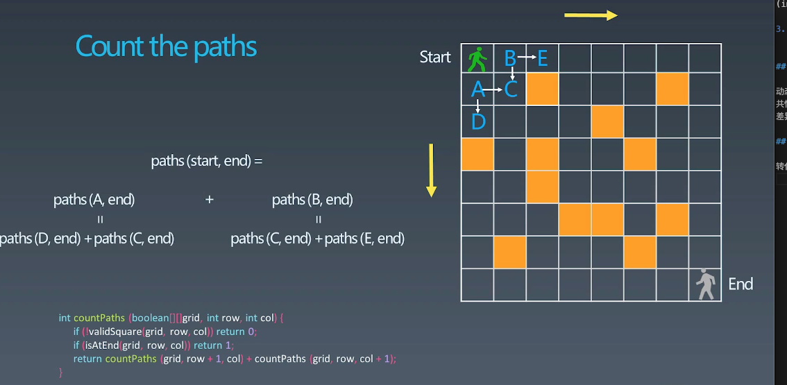
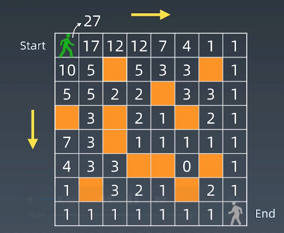

# 动态规划 dynamic programming

1. Wiki 定义

https://en.wikipedia.org/wiki/Dynamic_programming

2. "Simplifying a complicated problem by breaking it down into simpler subproblems"
(in a recursive manager)

3. Divide & Conquer + Optimal substructure 分治+最优子结构


## 关键点

动态规划和递归或者分治 没有根本上的区别 (关键看有无最优的子结构)  
共性： 找到重复子问题  
差异性： 最优子结构、中途可以淘汰次优解  

## 自底向上

转化递归为 递推


## 状态转移方程/动态规划方程/DP方程

```python
opt[i,j] = opt[i+1,j] + opt[i,j+1]
```

完整逻辑:

```python
if a[i,j] == '空地':
  opt[i+1,j] + opt[i,j+1]
else:
  opt[i,j] = 0
```

## 动态规划关键点

1. 最优子结构 opt[n] = best_of(opt[n-1]+ opt[n-2], ...)
2. 存储中间状态 opt[i]
3. 递推公式 (状态转移方程或者 DP方程)

    fib: opt[i] = opt[n-1]+opt[n-2]
    二维路径: opt[i,j] = opt[i+1][j]+opt[i][j+1] (且判断 a[i,j] 是否是空地)



