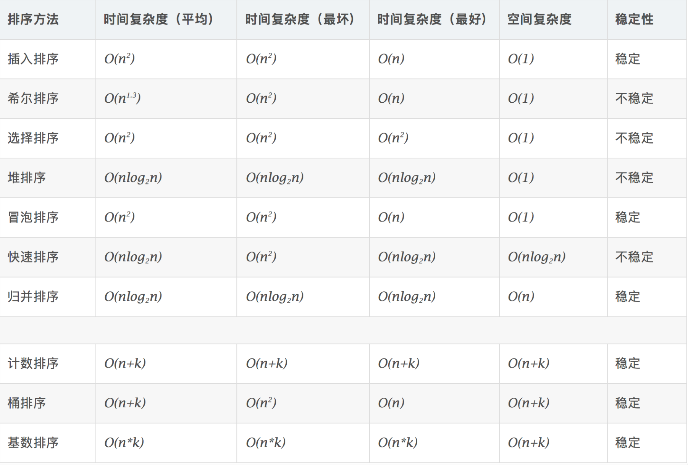

# 排序

## 参考链接

[十大经典排序算法](https://www.cnblogs.com/onepixel/p/7674659.html)  
[9 种经典排序算法可视化动画](https://www.bilibili.com/video/av25136272)  
[6 分钟看完 15 种排序算法动画展示](https://www.bilibili.com/video/av63851336)  

##  排序算法

1. 比较类排序: 通过比较来决定元素间的相对次序，由于其时间复杂度不能突破O(nlogn)，因此也称为非线性时间比较类排序。

2. 非比较类排序: 不通过比较来决定元素间的相对次序，它可以突破基于比较排序的时 间下界，以线性时间运行，因此也称为线性时间非比较类排序。


        排序算法
            比较类排序
                交换排序
                    冒泡排序
                    快速排序
                插入排序
                    简单插入排序
                    希尔排序
                选择排序
                    简单选择排序
                    堆排序
                归并排序
                    二路归并排序
                    多路归并排序
            非比较排序
                计数排序
                桶排序
                基数排序



##  初级排序 - O(n^2)

1. 选择排序(Selection Sort) 每次找最小值，然后放到待排序数组的起始位置。
2. 插入排序(Insertion Sort) 从前到后逐步构建有序序列;对于未排序数据，在已排序序列中从后 向前扫描，找到相应位置并插入。
3. 冒泡排序(Bubble Sort) 嵌套循环，每次查看相邻的元素如果逆序，则交换。

## 高级排序 - O(N*LogN)

### 快速排序(Quick Sort)

数组取标杆 pivot，将小元素放 pivot左边，大元素放右侧，然后依次 对右边和右边的子数组继续快排;以达到整个序列有序。

### 归并排序(Merge Sort)— 分治

1. 把长度为n的输入序列分成两个长度为n/2的子序列; 2. 对这两个子序列分别采用归并排序;
3. 将两个排序好的子序列合并成一个最终的排序序列。

        归并 和 快排 具有相似性，但步骤顺序相反
        归并:
            先排序左右子数组，然后合并两个有序子数组 
        快排:
            先调配出左右子数组，然后对于左右子数组进行排序


## 堆排序(Heap Sort) — 堆插入 O(logN)，取最大/小值 O(1)

1. 数组元素依次建立小顶堆 
2. 依次取堆顶元素，并删除

## 特殊排序 - O(n)

- 计数排序(Counting Sort) 计数排序要求输入的数据必须是有确定范围的整数。将输入的数据值转化为键存 储在额外开辟的数组空间中;然后依次把计数大于 1 的填充回原数组
- 桶排序(Bucket Sort)
桶排序 (Bucket sort)的工作的原理:假设输入数据服从均匀分布，将数据分到有 限数量的桶里，每个桶再分别排序(有可能再使用别的排序算法或是以递归方式 继续使用桶排序进行排)。
- 基数排序(Radix Sort) 基数排序是按照低位先排序，然后收集;再按照高位排序，然后再收集;依次类 推，直到最高位。有时候有些属性是有优先级顺序的，先按低优先级排序，再按 高优先级排序。


## 代码模版

### 冒泡排序

```
public void bubbleSort(int[] a) {

  if (a.length <= 0) return;
  for (int i = 0; i < a.length; i++) {
    boolean flag = false;
    for (int j = 0; j < a.length-i-1; j++) {
      if(a[j] > a[j+1]) {
        int tmp = a[j];
        a[j] = a[j+1];
        a[j+1] = tmp;
        flag = true;
      }
    }
    if (!flag) break;  // 没有数据交换，提前退出
  }
}
```

### 插入排序

```Java
public void insertionSort(int[] a) {

  int n = a.length;
  if(n <= 1) return;

  for (int i = 1; i < n; i++) {
      int value = a[i];
      int j = i-1;
      for (; j >= 0 ; j--) {
          if(a[j] > value) {
              a[j+1] = a[j];
          } else {
              break;
          }
      }
      a[j+1] = value;
  }
}
```

### 选择排序

```Java
public void selectionSort(int[] a){
  int n = a.length;
  if (n <= 0) return;
  for (int i = 0; i < n; i++) {
      int minIndex = i;
      for (int j = i; j < n; j++) {
          if(a[j] < a[minIndex]) {
              minIndex = j;
          }
      }
      if(minIndex != i) {
          int tmp = a[i];
          a[i] = a[minIndex];
          a[minIndex] = tmp;
      }
  }
}
```

### 归并排序

```Java
public void mergeSort(int[] a, int low, int high) {
    if (low >= high) return;

    int mid = (low + high) >>> 1;

    mergeSort(a, low, mid);
    mergeSort(a, mid+1, high);

    merge(a, low, mid, high);
}

public void merge(int[] a, int low, int mid, int high) {

    int i = low;
    int j = mid + 1;
    int k = 0;
    int[] tmp = new int[high-low+1];

    while(i <= mid && j <= high) {
        if(a[i] <= a[j]) {
            tmp[k++] = a[i++];
        } else {
            tmp[k++] = a[j++];
        }
    }

    int start = i;
    int end = mid;
    if (j <= high) {
        start = j;
        end = high;
    }

    while (start <= end) {
        tmp[k++] = a[start++];
    }

    for (int l = 0; l < high-low+1; l++) {
        a[low+l] = tmp[l];
    }
}
```

```Java
 // 归并排序代码-Java
public static void mergeSort(int[] array, int left, int right) {
    if (right <= left) return;
    int mid = (left + right) >> 1; // (left + right) / 2
    mergeSort(array, left, mid);
    mergeSort(array, mid + 1, right);
    merge(array, left, mid, right);
}

public static void merge(int[] arr, int left, int mid, int right) {
    int[] temp = new int[right - left + 1]; // 中间数组
    int i = left, j = mid + 1, k = 0;
    while (i <= mid && j <= right) {
        temp[k++] = arr[i] <= arr[j] ? arr[i++] : arr[j++];
    }
    while (i <= mid) temp[k++] = arr[i++];
    while (j <= right) temp[k++] = arr[j++];
    for (int p = 0; p < temp.length; p++) {
        arr[left + p] = temp[p];
    }
    // 也可以用 System.arraycopy(a, start1, b, start2, length) }
}
```

### 快排

```Java
// 快排代码-Java
public static void quickSort(int[] array, int begin, int end) {
    if (end <= begin) return;
    int pivot = partition(array, begin, end);
    quickSort(array, begin, pivot - 1);
    quickSort(array, pivot + 1, end);
}

static int partition(int[] a, int begin, int end) { // pivot: 标杆位置，counter: 小于pivot的元素的个数
    int pivot = end, counter = begin;
    for (int i = begin; i < end; i++) {
        if (a[i] < a[pivot]) {
            int temp = a[counter];
            a[counter] = a[i];
            a[i] = temp;
            counter++;
        }
    }
    int temp = a[pivot];
    a[pivot] = a[counter];
    a[counter] = temp;
    return counter;
}
```

### 堆排序

```Java
void heap_sort(int a[], int len) {
    priority_queue<int, vector<int>, greater<int>> q;
    for (int i = 0; i < len; i++) {
        q.push(a[i]);
    }
    for (int i = 0; i < len; i++) {
        a[i] = q.pop();
    }
}

static void heapify(int[] array, int length, int i) {
    int left = 2 * i + 1, right = 2 * i + 2;
    int largest = i;
    if (left < length && array[left] > array[largest]) {
        largest = leftChild;
    }
    if (right < length && array[right] > array[largest]) {
        largest = right;
    }
    if (largest != i) {
        int temp = array[i];
        array[i] = array[largest];
        array[largest] = temp;
        heapify(array, length, largest);
    }
}

public static void heapSort(int[] array) {
    if (array.length == 0) return;
    int length = array.length;
    for (int i = length / 2 - 1; i >= 0; i -)
        heapify(array, length, i);
    for (int i = length - 1; i >= 0; i--) {
        int temp = array[0];
        array[0] = array[i];
        array[i] = temp;
        heapify(array, i, 0);
    }
}
```