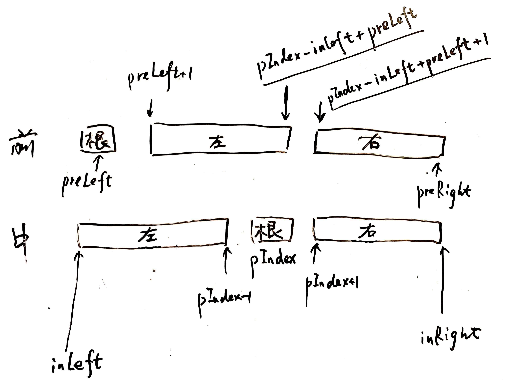

# [105. 从前序与中序遍历序列构造二叉树](https://leetcode-cn.com/problems/construct-binary-tree-from-preorder-and-inorder-traversal/)

根据一棵树的前序遍历与中序遍历构造二叉树。

注意:
你可以假设树中没有重复的元素。

例如，给出

```
前序遍历 preorder = [3,9,20,15,7]
中序遍历 inorder = [9,3,15,20,7]
```

返回如下的二叉树：

```
    3
   / \
  9  20
    /  \
   15   7
```

## 解法一




```Java
/**
 * Definition for a binary tree node.
 * public class TreeNode {
 *     int val;
 *     TreeNode left;
 *     TreeNode right;
 *     TreeNode(int x) { val = x; }
 * }
 */
class Solution {
    public TreeNode buildTree(int[] preorder, int[] inorder) {
        int preLen = preorder.length;
        int inLen = inorder.length;

        if (preLen != inLen) return null;

        Map<Integer, Integer> map = new HashMap<>();

        for (int i = 0; i < inLen; i++) {
            map.put(inorder[i], i);
        }
        return buildTree(preorder, 0, preLen - 1, map, 0, inLen - 1);
    }

    private TreeNode buildTree(int[] preorder, int preLeft, int preRight, 
        Map<Integer, Integer> map, int inLeft, int inRight
    ) {
        if (preLeft > preRight || inLeft > inRight) return null;

        int rootVal = preorder[preLeft];
        TreeNode root = new TreeNode(rootVal);
        int pIndex = map.get(rootVal);

        root.left = buildTree(preorder, preLeft + 1, pIndex - inLeft + preLeft, map, inLeft, pIndex - 1);
        root.right = buildTree(preorder, pIndex - inLeft + preLeft + 1, preRight, map, pIndex + 1, inRight);

        return root;
    }
}
```