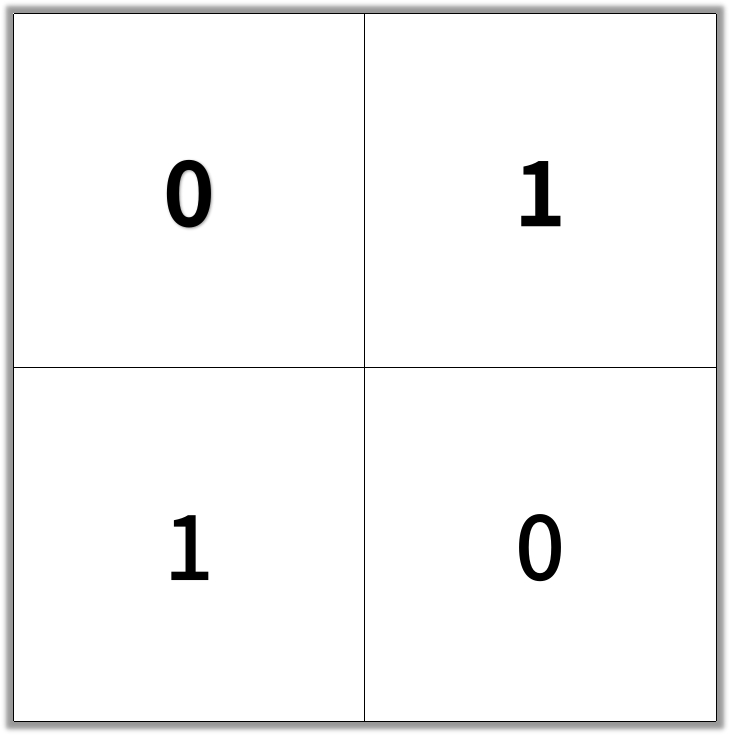
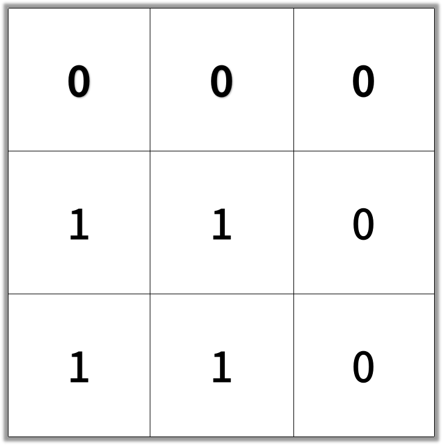

# 1091. 二进制矩阵中的最短路径

[题目地址](https://leetcode-cn.com/problems/shortest-path-in-binary-matrix)

在一个 N × N 的方形网格中，每个单元格有两种状态：空（0）或者阻塞（1）。

一条从左上角到右下角、长度为 k 的畅通路径，由满足下述条件的单元格 C_1, C_2, ..., C_k 组成：

相邻单元格 C_i 和 C_{i+1} 在八个方向之一上连通（此时，C_i 和 C_{i+1} 不同且共享边或角）
C_1 位于 (0, 0)（即，值为 grid[0][0]）
C_k 位于 (N-1, N-1)（即，值为 grid[N-1][N-1]）
如果 C_i 位于 (r, c)，则 grid[r][c] 为空（即，grid[r][c] == 0）
返回这条从左上角到右下角的最短畅通路径的长度。如果不存在这样的路径，返回 -1 。

 

示例 1：

输入：[[0,1],[1,0]]

输出：2


示例 2：

输入：[[0,0,0],[1,1,0],[1,1,0]]

输出：4

 

提示：

1 <= grid.length == grid[0].length <= 100
grid[i][j] 为 0 或 1


## 解法一

bfs

```python
class Solution:
    def shortestPathBinaryMatrix(self, grid: List[List[int]]) -> int:
        q, n = [(0, 0, 2)], len(grid) # (起点, 终点, 步数)
        if grid[0][0] or grid[-1][-1]: # 如果左上角(起点)和右下角(终点) 有一个为 1, 则永远都走不出去
            return -1
        elif n <= 2:
            return n
        
        for i, j, d in q:
            for x, y in [(i-1, j-1), (i-1, j), (i-1, j+1), (i, j-1), (i, j+1), (i+1, j-1), (i+1, j), (i+1, j+1)]:
                if 0 <= x < n and 0 <= y < n and not grid[x][y]:
                    if x == n - 1 and y == n - 1:
                        return d
                    q += [(x, y, d + 1)]
                    grid[x][y] = 1
        return -1
```

## 解法二

A*

估价函数:
h(current_point) = dist(current_point, destination_point)

<https://dataaspirant.com/2015/04/11/five-most-popular-similarity-measures-implementation-in-python/>  
<https://leetcode.com/problems/shortest-path-in-binary-matrix/discuss/313347/A*-search-in-Python/>

