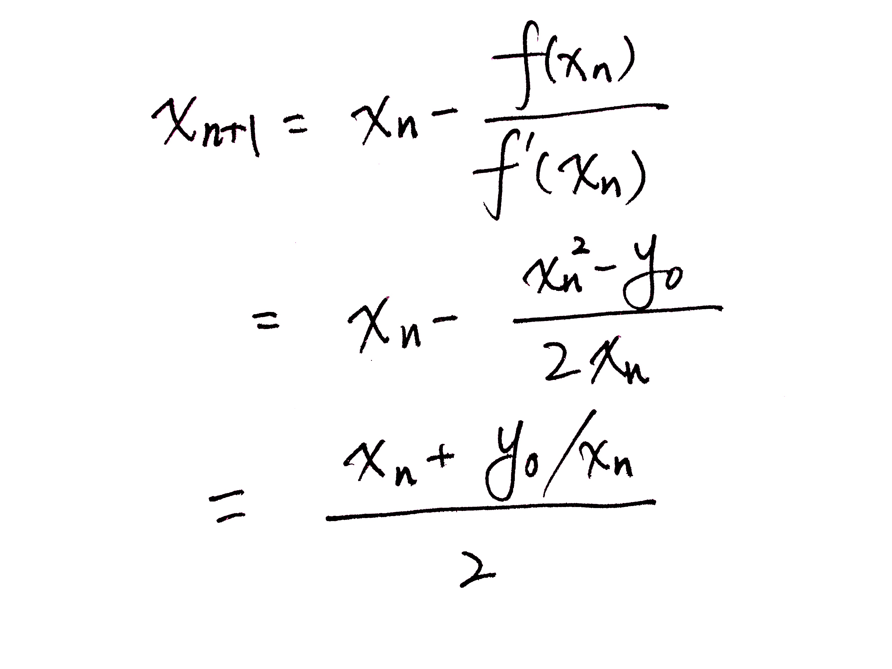

# 69. x 的平方根

实现 int sqrt(int x) 函数。

计算并返回 x 的平方根，其中 x 是非负整数。

由于返回类型是整数，结果只保留整数的部分，小数部分将被舍去。

示例 1:

```
输入: 4
输出: 2
```

示例 2:

```
输入: 8
输出: 2
说明: 8 的平方根是 2.82842..., 
     由于返回类型是整数，小数部分将被舍去。
```

## 解法一

二分查找

```Java
class Solution {
    public int mySqrt(int x) {
        int left = 0;
        int right = x;
        int ans = -1;

        while(left <= right) {
            int mid = (left+right) >>> 1;
            if ((long)mid * mid <= x) {
                ans = mid;
                left = mid + 1;
            } else {
                right = mid - 1;
            }
        }
        return ans;
    }
}
```

```Java
class Solution {
    public int mySqrt(int x) {
        
        if (x == 0 | x == 1) return x;

        long left = 1, right = x;
        while (left <= right) {
            long mid = (left + right) >>> 1;
            
            if (mid * mid > x) {
                right = mid - 1;
            } else {
                left = mid + 1;
            }
        }
        return (int)right;
    }
}
```

```Java
class Solution {
    public int mySqrt(int x) {

        if (x == 0 || x == 1) return x;
        int left = 0, right = x, result = 0;
        while (left <= right) {
            int mid = (left + right) >>> 1;
            if (mid == x / mid) return mid; // mid * mid 可能会越界，所以直接用除法
            else if (mid > x / mid) {
                right = mid - 1;
            } else {
                left = mid + 1;
                result = mid;
            }
        }
        return result;
    }

}
```

## 解法二  

牛顿迭代法



[Origin of Quake3's Fast InvSqrt()](https://www.beyond3d.com/content/articles/8/)

```Java
class Solution {
    public int mySqrt(int x) {
        
       long r = x;
       while (r * r > x) {
           r = (r + x / r) / 2;
       }
       return (int)r;
    }
}
```