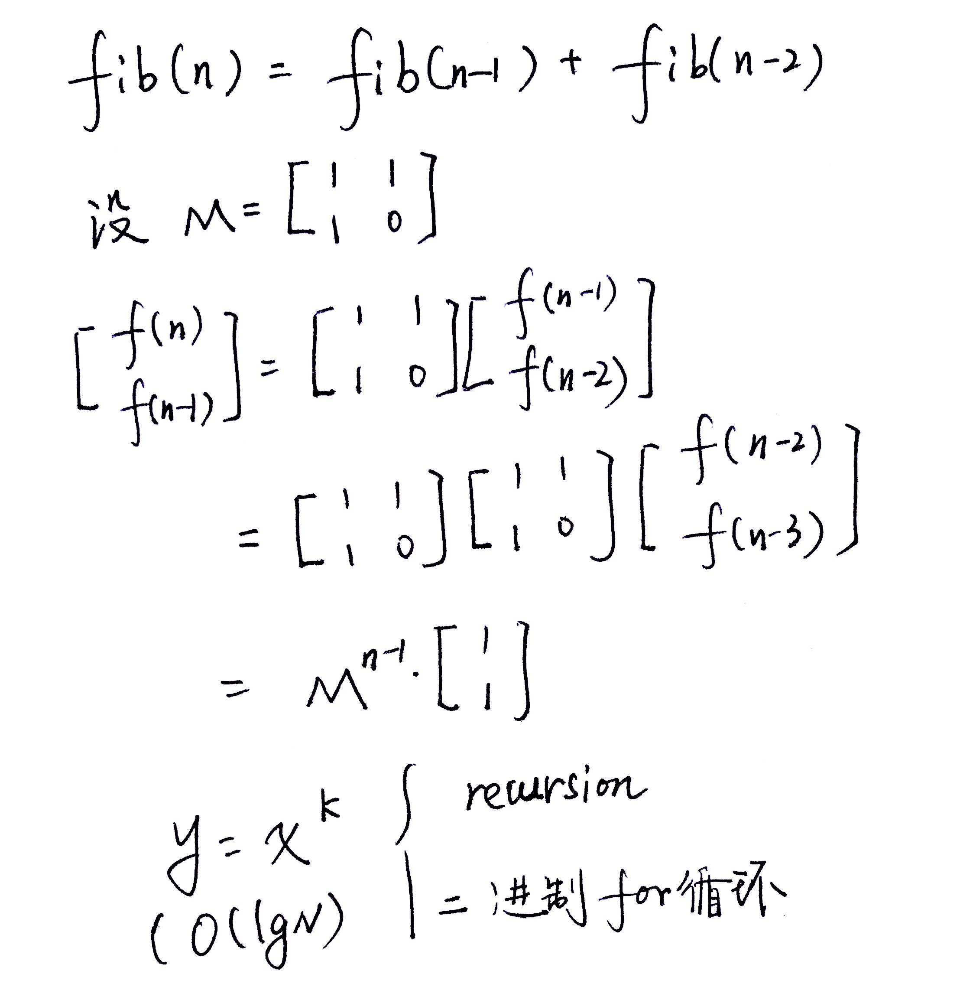

# 爬楼梯

[题目地址](https://leetcode-cn.com/problems/climbing-stairs)

假设你正在爬楼梯。需要 n 阶你才能到达楼顶。

每次你可以爬 1 或 2 个台阶。你有多少种不同的方法可以爬到楼顶呢？

注意：给定 n 是一个正整数。

示例 1：

```
输入： 2
输出： 2
解释： 有两种方法可以爬到楼顶。
1.  1 阶 + 1 阶
2.  2 阶
```

示例 2：

```
输入： 3
输出： 3
解释： 有三种方法可以爬到楼顶。
1.  1 阶 + 1 阶 + 1 阶
2.  1 阶 + 2 阶
3.  2 阶 + 1 阶
```

## 思路

单词:

    Elevator 电梯
    Escalator 扶梯


相邻两步的步伐不能相同

1: 1  
2: 2  
3: f(1) + f(2)  mutual exclusive, conmplete exhaustive
4: f(3) + f(2)   

f(n) = f(n-1) + f(n-2) : Fibonacci

暴力解法时间复杂度为 O(2^n) (画出状态树，第一层一个，第二层两个，第三层四个..., 为指数级)


## 爬楼梯问题变种

1. 每次只能走 1、2、3

```Java
class Solution {

    public int climbStairs(int n) {
        if (n <= 1) return n;

        int[] dp = new int[n];
        
        dp[0] = 1;
        dp[1] = 2;
        dp[2] = 3;

        for(int i = 3; i <= n; i++) {
           dp[i] = dp[i - 1] + dp[i - 2] + dp[i - 3];
        }
        return dp[n - 1];
    }
}
```

- 每次只能走 `int[] x = [X1, X2, ..., Xm]` 步中的一种

```Java
class Solution {

    public int climbStairs(int n) {
        if (n <= 1) return n;

        int[] dp = new int[n];
        
        dp[0] = 1;
        dp[1] = 2;

        for(int i = 2; i <= n; i++) {
            for (int j = 0; j < m; j++) {
                dp[i] += dp[i - x[j]]; // 走了 x[j] 步, 必须是从 i - x[j] 上来的
            }
           
        }
        return dp[n - 1];
    }
}
```

- 每次只能走 `int[] x = [X1, X2, ..., Xm]` 步中的一种，且前后不能走相同的步伐

```Java
class Solution {

    public int climbStairs(int n) {
        if (n <= 1) return n;

        int[] dp = new int[n + 1][x.length];
        
        // dp[i][x[k]] i 表示上到第几阶台阶，第二维表示我走的是几步
        dp[0][0] = 1;
        dp[1][] = 2;

        for(int i = 3; i <= n; i++) {
            for (int j = 0; j < m; j++) {
                for (int k = 0; k < m; k++) {
                    if (k != j) dp[i][x[k]] += dp[i - x[j]][x[k]];
                }
            }
        }

        int result = 0;
        for (int k = 0; k < m; k++) {
            result += dp[n][x[k]];
        }
        return result;
    }
}
```

### 扩展题

<https://leetcode-cn.com/problems/min-cost-climbing-stairs/>


### 矩阵法解决 fibnacii



## 解法一

记忆化搜索 O(n)

```Java
class Solution {

    Map<Integer, Integer> mem = new HashMap<>();
    
    public int climbStairs(int n) {
        
        if (n <= 2) return n;
        if (mem.containsKey(n)) return mem.get(n);
        mem.put(n, climbStairs(n - 1) + climbStairs(n - 2));
        return mem.get(n);
    }
}
```

## 解法二

DP

```Java
class Solution {
    public int climbStairs(int n) {

        if (n <= 2) return n;

        int[] dp = new int[n + 1];
        dp[1] = 1;
        dp[2] = 2;
        
        for (int i = 3; i <= n; i++) {
            dp[i] = dp[i - 1] + dp[i -2];
        }
        return dp[n];
    }
}
```

DP 只存储最后两个元素

```Java
class Solution {
    public int climbStairs(int n) {

        if (n <= 2) return n;

        int[] dp = new int[3];
        dp[0] = 1;
        dp[1] = 2;

        int result = 0;
        for (int i = 3; i <= n; i++) {
            dp[2] = dp[0] + dp[1];
            dp[0] = dp[1];
            dp[1] = dp[2]; 
        }
        return dp[2];
    }
}
```

DP 简化

```Java
class Solution {
    public int climbStairs(int n) {
        
        if (n <= 2) return n;

        int f1 = 1, f2 = 2, f3 = 0;
        for (int i = 3; i <= n; i++) {
            f3 = f1 + f2;
            f1 = f2;
            f2 = f3;
        }
        return f3;
    }
}
```

```python
class Solution:
    def climbStairs(self, n: int) -> int:
        x, y = 1, 1
        for _ in range(1, n):
            x, y = y, x + y
        return y
```

## 解法三

转换为零钱兑换问题

每次可以用 1 块钱, 2 块钱，凑 n 元。
